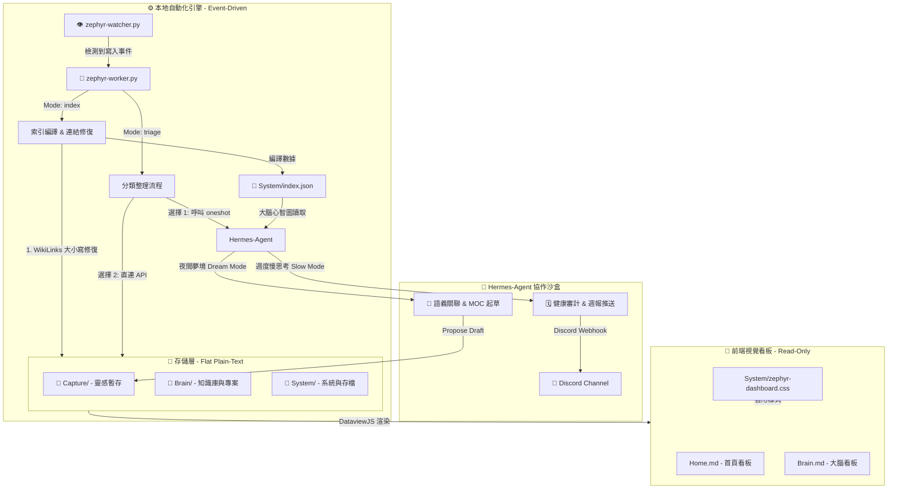

# Zephyr 技術架構說明書

本文件詳述 **Zephyr 第二大腦** 的底層技術設計、組件交互、腳本運算邏輯及人機協作機制。

---

## 1. 架構總覽 (Architecture Overview)

Zephyr 摒棄了需要數據庫服務器或重型常駐服務的傳統架構，採用**「本地純文本存儲 + 事件驅動處理器 + 週期性 AI 智能體反射」**的輕量化設計。其核心機制為 **按需啟動 (On-demand execution)**，以達到零內存佔用與極速響應。



---

## 2. 存儲層與命名規範 (Storage Layer & Conventions)

為了確保 AI 讀寫效率，並徹底杜絕命令行或腳本解析文件路徑時的報錯，Zephyr 執行嚴格的命名與文件格式規範：

### 2.1 目錄結構與分類
整個知識庫物理上僅包含三個目錄：
1. **`Capture/`**：臨時寫入區。包含每日日誌（Daily Logs，格式為 `YYYY-MM-DD.md`）和剪報、隨筆。
2. **`Brain/`**：常青庫。所有知識點、活動專案一律**扁平平鋪（Flat Structure）**於此，不允許建立子目錄。
3. **`System/`**：系統目錄。存放 AI 技能（Skills）、筆記模板（Templates）、索引快取及歷史封存（Archive）。

### 2.2 命名安全規範 (NTFS-Safe Naming)
* **禁止空格**：所有文件名一律不包含空格，使用連字符 `-` 連接（如 `intelligent-routing.md`）。
* **禁止表情符號 (Emojis)**：文件名禁止包含任何 Emojis，防止命令行或腳本調用時發生編碼錯誤。
* **禁止特殊字符**：嚴格限制只能使用 `a-z`, `A-Z`, `0-9`, `-`, `_`。

### 2.3 筆記元數據 Schema
每篇筆記頭部必須包含 YAML Frontmatter。Zephyr 定義了三種核心筆記類型：
1. **專案筆記 (`type: project`)**：
   ```yaml
   ---
   type: project
   status: active # active | paused | completed | archived
   priority: medium # high | medium | low
   deadline: YYYY-MM-DD
   area: tech-dev # 對應的知識領域
   ---
   ```
2. **常青筆記 (`type: note`)**：
   ```yaml
   ---
   type: note
   tags: [knowledge, ai, routing] # 標籤集合
   # MOC / Portal 筆記需額外包含 tags: [moc]
   # 知識領域筆記需包含 tags: [area/topic-name]
   ---
   ```
3. **日誌筆記 (`type: log`)**：
   ```yaml
   ---
   type: log
   date: YYYY-MM-DD
   tags: [daily]
   ---
   ```

---

## 3. 本地 Python 自動化引擎

本地引擎是 Zephyr 「無感運行」的核心保障。它由兩個 Python 腳本構成，通過 Windows 批處理文件 `run-watcher.bat` 啟動：

### 3.1 `zephyr-watcher.py` (事件監聽器)
* **機制**：使用 Python `watchdog` 庫（或輕量級目錄輪詢）實時監聽 `Capture/` 與 `Brain/` 目錄。
* **觸發**：當檢測到 Markdown 建立或修改時，會在 debounce 後按需觸發 `zephyr-worker.py index`。
* **優點**：Watcher 本身為事件驅動，不執行運算，平時 CPU/內存佔用接近 0。

### 3.2 `zephyr-worker.py` (核心處理器)
Worker 僅執行可驗證的本地維護：
1. **WikiLinks 雙鏈修復 (Link Healing)**：
   * 掃描筆記正文中的 `[[Note Name]]`。
   * 比對數據庫中的所有檔名，自動修復大小寫不匹配（如 `[[intelligent-routing]]` -> `[[Intelligent-Routing]]`）。
2. **編譯大腦地圖 (`System/index.json`)**：
   * Worker 會掃描所有有效筆記，提取文件名、修改時間、YAML 元數據、第一段摘要及出入雙鏈關係。
   * 將其打包編譯為一個壓縮的 JSON 索引快取。
3. **明確 Git 同步**：只有 `python3 System/zephyr-worker.py sync` 可以執行 commit、rebase pull 與 push。

#### 📄 `System/index.json` 的 Schema 結構示例：
```json
{
  "notes": {
    "Intelligent-Routing": {
      "path": "Brain/Intelligent-Routing.md",
      "type": "note",
      "mtime": 1799834212,
      "tags": ["routing", "ai"],
      "summary": "This evergreen note conceptualizes an intelligent message router for LLM agent coordination.",
      "links_out": ["Hermes-Agent", "System-Architecture"],
      "links_in": ["Home"]
    },
    "Project-Zephyr": {
      "path": "Brain/Project-Zephyr.md",
      "type": "project",
      "status": "active",
      "priority": "high",
      "deadline": "2026-08-30",
      "mtime": 1799834500,
      "links_out": [],
      "links_in": []
    }
  }
}
```

---

## 4. Hermes-Agent 協作沙盒 (Agent Space)

AI 智能體（Hermes-agent）的運行機制完全建立在讀取 `System/index.json` 的基礎之上。這極大簡化了 AI 的輸入上下文。

### 4.1 反應式即時分類：Inbox Triage
* **頻率**：事件驅動（由 `zephyr-watcher.py` 在 `Capture/` 中檢測到新 Markdown 檔案時即時觸發）。
* **邏輯**：
  1. `zephyr-watcher.py` 執行 `zephyr-worker.py triage`。
  2. Worker 檢索未分類筆記，若存在，優先嘗試以 One-shot 模式呼叫 `hermes -z` 執行分類技能。
  3. 若 Hermes 未安裝或未登入，Worker 會退而使用 [config_local.json](file:///c:/Users/sadri/workspace/Zephyr/config_local.json) 中的配置直接呼叫 LLM API。
  4. 分類程式讀取筆記正文，補齊 frontmatter schema，重新命名為 Windows 安全檔名，並將有把握的 `note` / `project` 移入 `Brain/`。
  5. 模糊筆記保留在 `Capture/`，標記 `triage_status: needs_review`。
  6. 處理完成後，自動執行本機索引更新（`zephyr-worker.py index`）。
* **認證**：Hermes 模式下直接套用您已登入的本地 profile（可由 `init-zephyr.py` 額外指定 provider/model 覆寫）；直連 API 模式則讀取並使用安全保存在 `config_local.json` 裡的 `ai_api_key`。

### 4.2 雙向心流的引導機制：Dream Mode (夜間夢境)
* **頻率**：每晚自動運行。
* **邏輯**：
  1. AI 讀取 `index.json`，對過去 24 小時內修改過的筆記正文進行語義掃描。
  2. 比對庫中其他筆記的標題，尋找隱含的語義關聯。
  3. **追加雙鏈（非侵入）**：AI 不會直接修改用戶寫的正文，而是在文件底部追加：
     ```markdown
     ## 🔗 Suggested Connections
     * [[Related-Note-A]]: 發現語義關聯的簡短理由。
     ```
  4. **主題聚合 (MOC Draft)**：若發現 3 篇以上未聚合的常青筆記共享同一主題，AI 在 `Capture/` 下自動生成 `MOC - <主題> -- draft.md` 的提案草稿。

### 4.3 全局監控與提醒：Slow Mode (週度慢思考)
* **頻率**：每週一清晨。
* **邏輯**：
  1. AI 掃描 `index.json`，尋找 `type: project` 且 `status: active` 的專案。
  2. 對比截止日期，劃分高風險與逾期項目。
  3. 掃描孤立筆記（Backlinks 數為 0 的 Note）與斷頭鏈接（指引向不存在筆記的雙鏈）。
  4. **Discord Webhook**：將審計結果與進度週報格式化，透過 Discord Webhook 推送到配置的頻道中。

### 4.3 提案制協作流程 (Draft-Propose Flow)
```
[ 🤖 Hermes 產出想法/筆記 ] 
        │
        ▼ (將內容格式化為標準 Markdown)
[ 📝 寫入 Capture/ ] (命名後綴: `<名稱> -- draft.md`)
        │
        ▼ (向人類發送輕量提示)
[ 👁️ 人類閱讀與確認 ] 
        │
        ├──> (拒絕提案) ──> 直接刪除該草稿或保留修改
        │
        └──> (接受提案) ──> 去掉 `-- draft` 後綴 ──> 下一次 Hermes inbox triage 處理
```

---

## 5. 前端視覺看板層 (Obsidian UI Layer)

Zephyr 拒絕在 Markdown 筆記中嵌入厚重的 HTML 代碼。所有的動態看板均使用 **DataviewJS** + **Vanilla CSS Snippet** 渲染：

* **非侵入式容器**：看板頁面（如 `Home.md`）僅聲明程式碼區塊。在程式碼區塊內部，通過 `dv.container.createEl("div", { cls: "..." })` 動態創建 HTML DOM。
* **無雜訊主題化**：配合 `System/zephyr-dashboard.css`，看板自動適應 Obsidian 的明暗色調（明色為 Warm Monochrome 暖單色紙張質感，暗色為 Minimalist Dark 灰度質感）。
* **極簡約束**：禁止使用帶圓角的大陰影、發光按鈕和裝飾性 Emoji。所有的圖標（日曆、收件箱、筆記）均為 SVG 向量 primitive 繪製，呈現出乾淨、印刷質感的版面。
