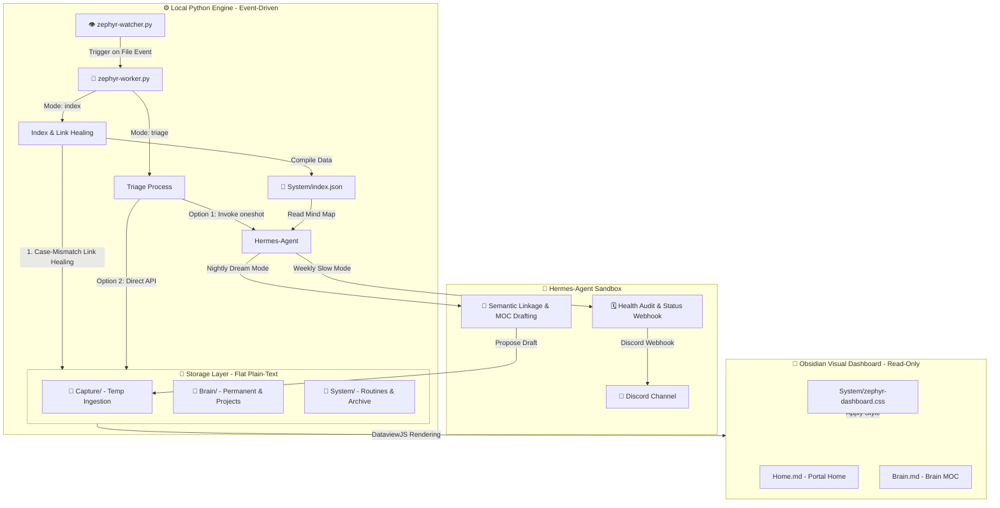

# Zephyr Technical Architecture Document

This document outlines the underlying technical design, component interactions, script run logic, and human-agent collaboration mechanisms of the **Zephyr Second Brain**.

---

## 1. Architecture Overview

Zephyr rejects traditional database servers and resource-heavy background daemons. Instead, it employs a lightweight model combining **local plain-text storage, event-driven processors, and periodic AI agent reflections**. The system relies on **On-demand execution** to achieve zero idling memory footprints and fast responsiveness.



---

## 2. Storage Layer & Naming Conventions

To guarantee AI reading efficiency and completely eliminate path parsing errors in command lines or scripts, Zephyr enforces strict naming and file format rules:

### 2.1 Directory Structure & Categories
The knowledge base physically consists of only three folders:
1. **`Capture/`**: Ingestion zone. Contains Daily Logs (formatted as `YYYY-MM-DD.md`), raw web clips, and temporary notes.
2. **`Brain/`**: Permanent brain. All evergreen notes and active projects are stored **flat (Flat Structure)**. Nested sub-directories are forbidden.
3. **`System/`**: System vault. Stores agent skills, note templates, metadata cache, and archived notes.

### 2.2 Naming Safety Rules (NTFS-Safe Naming)
* **No Spaces**: All filenames must replace spaces with hyphens (e.g., `intelligent-routing.md`).
* **No Emojis**: Emojis are strictly banned in filenames to prevent path compilation failures.
* **No Special Characters**: File naming is strictly restricted to alphanumeric characters and basic separators: `a-z`, `A-Z`, `0-9`, `-`, `_`.

### 2.3 Note Metadata Schemas
Every note must begin with a YAML Frontmatter block. Zephyr defines three core note schemas:
1. **Project Notes (`type: project`)**:
   ```yaml
   ---
   type: project
   status: active # active | paused | completed | archived
   priority: medium # high | medium | low
   deadline: YYYY-MM-DD
   area: tech-dev # Knowledge area it maps to
   ---
   ```
2. **Evergreen Notes (`type: note`)**:
   ```yaml
   ---
   type: note
   tags: [knowledge, ai, routing] # Topic tags
   # MOC / Portal notes also include tags: [moc]
   # Knowledge area notes also include tags: [area/topic-name]
   ---
   ```
3. **Daily Logs (`type: log`)**:
   ```yaml
   ---
   type: log
   date: YYYY-MM-DD
   tags: [daily]
   ---
   ```

---

## 3. Local Python Automation Engine

The local engine handles all format sorting and index compilation silently. It is launched via the Windows batch file `run-watcher.bat`:

### 3.1 `zephyr-watcher.py` (File Event Watcher)
* **Mechanism**: Uses the Python `watchdog` library (or directory polling) to monitor `Capture/` and `Brain/` in real-time.
* **Trigger**: When a Markdown file changes, it calls `zephyr-worker.py index` after debounce.
* **Resource Cost**: Watcher runs passively as an event-driven daemon, keeping CPU and memory overhead near 0.

### 3.2 `zephyr-worker.py` (Core Worker)
The worker performs deterministic local maintenance only:
1. **Case-Mismatch Link Healing**:
   * Scans markdown text for WikiLinks `[[Note Name]]`.
   * Cross-references titles in the vault to heal discrepancies (e.g., auto-updates `[[intelligent-routing]]` -> `[[Intelligent-Routing]]`).
2. **Brain Map Indexing (`System/index.json`)**:
   * Scans all active files and compiles title structures, tags, modifications times, first-paragraph summaries, and in/out WikiLink relationships.
   * Compiles this data into a single, compact JSON index cache.
3. **Explicit Git Sync**: `python3 System/zephyr-worker.py sync` is the only mode that may commit, pull with rebase, and push.

#### 📄 Example `System/index.json` Schema:
```json
{
  "notes": {
    "Intelligent-Routing": {
      "path": "Brain/Intelligent-Routing.md",
      "type": "note",
      "mtime": 1799834212,
      "tags": ["routing", "ai"],
      "summary": "This evergreen note conceptualizes an intelligent message router for LLM agent coordination.",
      "links_out": ["Hermes-Agent", "System-Architecture"],
      "links_in": ["Home"]
    },
    "Project-Zephyr": {
      "path": "Brain/Project-Zephyr.md",
      "type": "project",
      "status": "active",
      "priority": "high",
      "deadline": "2026-08-30",
      "mtime": 1799834500,
      "links_out": [],
      "links_in": []
    }
  }
}
```

---

## 4. Hermes-Agent Collaborative Sandbox (Agent Space)

AI agents (like Hermes-agent) rely completely on `System/index.json` to load context, simplifying token consumption.

### 4.1 Reactive Inbox Triage
* **Frequency**: Event-driven (triggered instantly by `zephyr-watcher.py` upon additions/modifications of markdown files in `Capture/`).
* **Workflow**:
  1. `zephyr-watcher.py` runs `zephyr-worker.py triage` when eligible changes occur.
  2. The worker scans for unclassified files. If found, it attempts to run `hermes -z` (one-shot mode) to execute the triage skill.
  3. If Hermes is not present or authenticated, the worker falls back to invoking the direct LLM API using the settings in `config_local.json`.
  4. The active triage system reads the note body, adds the fixed frontmatter schema, renames the note to a Windows-safe title, and moves confident `note` / `project` results to `Brain/`.
  5. Ambiguous notes remain in `Capture/` with `triage_status: needs_review`.
  6. Reindexing (`zephyr-worker.py index`) runs automatically at the end of the triage process.
* **Authentication**: Hermes triage uses your logged-in session (with optional model/provider overrides configured via `init-zephyr.py`); direct API fallback uses `ai_api_key` securely stored in `config_local.json`.

### 4.2 Nightly Link Weaving: Dream Mode
* **Frequency**: Triggered nightly.
* **Workflow**:
  1. AI reads `index.json` and scans note bodies modified within the past 24 hours.
  2. Compares text against all vault titles to detect semantic associations.
  3. **Appends Recommended Links (Non-intrusive)**: AI does not modify human-authored text. It appends recommendations under a dedicated header at the bottom:
     ```markdown
     ## 🔗 Suggested Connections
     * [[Related-Note-A]]: Brief semantic connection description.
     ```
  4. **Topic Cluster Detection**: If 3 or more unlinked notes share a new concept, AI drafts a proposed Map of Contents note (`MOC - <Topic> -- draft.md`) in `Capture/`.

### 4.3 Weekly Auditing & Alerting: Slow Mode
* **Frequency**: Runs every Monday morning.
* **Workflow**:
  1. AI scans `index.json` for active projects (`status: active`).
  2. Calculates deadline risks (High Risk < 7 days, Overdue).
  3. Audits vault health (detects orphaned notes and broken internal links).
  4. **Discord Webhook Delivery**: Compiles details and posts a clean markdown report to the configured Discord channel.

### 4.3 Draft-Propose Pattern
```
[ 🤖 Hermes-Agent Generates Content ] 
                    │
                    ▼ (Format to Standard Markdown)
[ 📝 Writes to Capture/ ] (Suffix: `<Title> -- draft.md`)
                    │
                    ▼ (Send notification to human)
[ 👁️ Human Reviews Draft ] 
                    │
                    ├──> (Rejects Proposal) ──> Delete draft or edit manually
                    │
                    └──> (Accept Proposal) ──> Remove `-- draft` suffix ──> Hermes inbox triage handles it on its next run
```

---

## 5. UI Presentation Layer (Obsidian Visuals)

Zephyr bans layout HTML embedded inside Markdown notes. Instead, dashboards are generated dynamically via **DataviewJS** combined with a **Vanilla CSS Snippet**:

* **Clean Containers**: Layout notes (like `Home.md`) only contain DataviewJS codeblocks. DOM wrappers are instantiated dynamically in Javascript (`dv.container.createEl()`).
* **Visual Adaptability**: Backed by `System/zephyr-dashboard.css`, the layout adapts automatically to dark and light modes (delivering a warm monochrome, editorial paper style in light mode, and a muted, distraction-free slate theme in dark mode).
* **Minimalist Constraints**: Strict rules ban visual clutter (no box shadows, pill buttons, or decorative emojis). Every visual marker is a sharp, inline SVG primitive.
