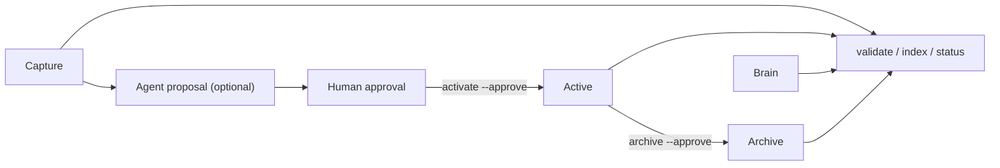

# Zephyr v0.3.0 Architecture

Zephyr’s data source of truth is a flat set of local Markdown files. The Python worker is deterministic: it parses YAML, validates schemas, generates the index, reports link issues, and performs only explicitly approved moves.

The optional watcher debounces local Markdown changes and calls `refresh`. The deterministic worker validates, indexes, reports links, and writes `System/review-queue.json`; these generated files are not the source of truth. The watcher cannot call an agent CLI, an LLM API, or mutate notes.

Semantic automation is a separate opt-in layer. An external agent may create a collision-safe companion draft in `Capture/`, but it cannot change the source or perform a lifecycle move. Approved projects use `activate`, approved durable notes use `promote`, and completed/stopped projects use `archive`.

Agent CLIs are optional adapters. Zephyr has no permanent primary or secondary agent: one active operator may write during a task or session, while optional reviewers and specialists are read-only by default. They may read the protocol and prepare proposals, but no provider, cloud service, API key, database server, or network connection is required by the core.
